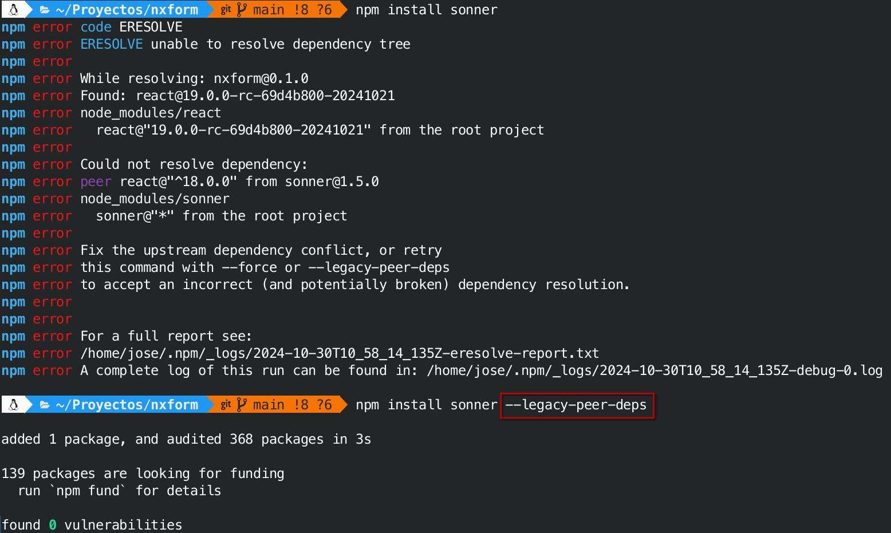
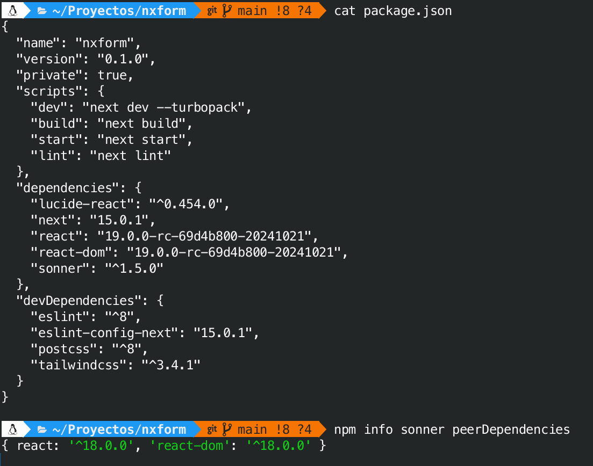

# NxForm

Ejemplo de uso de `Server Actions` en NextJS 15+ y React 19.

Características desarrolladas:

1. El botón de submit se deshabilita mientras se hace el envío de datos.
2. El resultado de la ejecución de la acción en el servidor es mostrado en un Toast.


## Instalación de Sonner (toast)

A fecha de Octubre 2014, la instalación del paquete sonner no funciona sobre React 19, por tanto debemos indicar, que aunque en nuestro proyecto trabajaremos con React 19, al instalar sonner se instalen además las dependencias que éste requiere, aunque no aparecerán reflejadas en `package.json`.

En un futuro próximo esto no será necesario.

```sh
npm install sonner --legacy-peer-deps
``` 



```sh
npm info sonner peerDependencies
``` 

